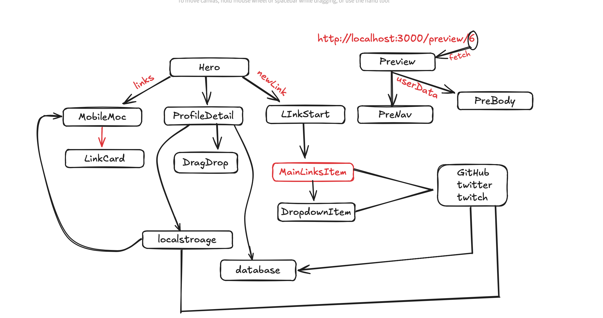

# How to Run This Project



1. Clone the Repository: First, clone the repository to your local machine. Open your terminal and run:
```js
git clone https://github.com/khandokarIsmailDev/ismail-link-sharing-app.git
cd ismail-link-sharing-app
```

2. Install Node.js: Make sure you have Node.js installed on your computer. You can download it from nodejs.org. Check the installation by running:
```js
node -v
npm -v
```

3. Install Dependencies: Since the node_modules directory is not present, you need to install the project dependencies. Run the following command in your project directory:
```js
npm install
```


4. Run Prisma Migrations: Execute the following command:

```js
npx prisma migrate dev
npx prisma generate
```


5. Run the Development Server: After installing dependencies and configuring the environment variables, you can start the development server by running:
```js
npm run dev
```

6. Access the Application: Open your web browser and go to http://localhost:3000 to see your Next.js application running.


# vercel live link 
- https://ismail-link-sharing-app.vercel.app/
